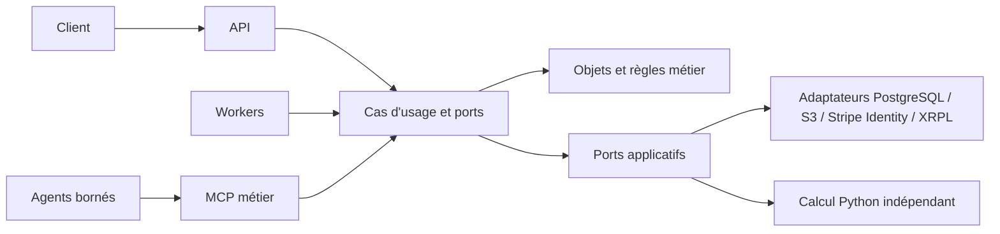

# Architecture validée — Octro v2.2

Cette décision précise les chapitres 9, 23 et 31 du [CDC v2.2](v2.2/Octro_CDC_v2.2.md), sans modifier le pack. Elle s'applique aux trois publics P0 et au Track 1 Loaded. Le [registre d'exigences](../requirements.json) reste inchangé sur ses IDs et critères ; `packages/application/` explicite la frontière entre règles métier et cas d'usage.

## Responsabilités et dépendances

| Couche | Emplacement ou intégration | Responsabilité et limite |
| --- | --- | --- |
| Domaine | `packages/domain/` | Objets, valeurs et règles métier : Workspace, événements, réserves, plans et transitions. Aucun SDK ledger, SQL, transport HTTP, framework web ou LLM. |
| Application | `packages/application/` | Cas d'usage et ports de persistance, stockage, vérification, calcul et exécution. Orchestre le domaine, les autorisations et l'idempotence ; ne dépend pas des implémentations des adaptateurs. |
| Entrées | `apps/api/`, `apps/worker/`, `packages/mcp/` | Adaptent requêtes HTTP, jobs et appels MCP vers les mêmes cas d'usage. Validation du transport et traduction des erreurs, sans copie des règles métier. |
| Adaptateurs | PostgreSQL, S3, Stripe Identity, XRPL | Implémentent les ports définis par l'application. PostgreSQL conserve état, jobs/outbox et audit ; S3 conserve les objets ; Stripe Identity vérifie une capacité nécessitant une identité ; XRPL adapte les opérations ledger. |
| Optimisation | `services/optimizer/` | Calcul Python déterministe MPC/LP/CVaR. Entrées/sorties normalisées ; aucune dépendance de calcul à FastAPI, au LLM ou au SDK XRPL. |
| Présentation | `apps/client/`, `packages/ui/` | Interface et états issus des cas d'usage ; ne recalcule pas le plan financier. |
| Agents | `packages/agents/` | Orchestration bornée, appels autorisés et explication du plan ; aucune signature ou soumission. |
| Contrats | `packages/contracts/` | Schémas partagés, distincts des modèles de persistance et des payloads natifs XRPL. |

Le sens des dépendances est : entrées → application → domaine. Les adaptateurs implémentent les ports de l'application ; leur assemblage appartient à la composition des services, hors domaine. Les emplacements concrets des adaptateurs PostgreSQL, S3 et Stripe Identity seront définis lors de l'implémentation, sans créer ici de code ou de dépendances. Les adaptateurs XRPL se trouvent dans `packages/xrpl/` selon le pack.

FastAPI peut exposer le calcul Python par un transport interne. Les fonctions de calcul doivent pouvoir être appelées et testées sans démarrer FastAPI ni joindre un modèle. Le moteur reçoit des capacités normalisées et produit un plan ; l'application reste responsable des autorisations et de toute préparation financière.

## Chemin commun d'exécution

Les flèches vers les adaptateurs illustrent les appels à l'exécution ; les dépendances de code restent dirigées vers les ports. API, workers et MCP partagent les contrôles de Workspace, capacité, version attendue, approbation et idempotence (`SEC-01`, `SEC-02`, `SEC-03`, `SEC-05`). Un outil MCP ne contourne jamais l'application (`AGT-02`, `MCP-02`). Signature et soumission restent dans le parcours déterministe autorisé, hors des outils du LLM.

## Invariants du périmètre

- `PER-03`, `ACC-01` : Workspace personnel sans Organization obligatoire ; les espaces restent isolés.
- `ACC-02`, `PER-11`, `NET-02` : prévisions accessibles sans wallet ni crédit ; absence de KYC ou de capacité réseau ne bloque pas le socle.
- `DATA-02`, `DATA-03`, `PER-04` : séparer prévision et cash confirmé, utiliser des montants décimaux et ne pas transformer un transfert propre en revenu.
- `ENG-01`, `ENG-02`, `ENG-04`, `ENG-05` : plans reproductibles, contraintes revérifiées après arrondi, diagnostic d'infaisabilité sans action, dette terminale conservée.
- `LOAD-01`, `LOAD-02`, `LOAD-03`, `ARCH-LOAD-01` : Credentials/Domains est l'extension Loaded principale ; distinguer contrôle ledger et décision applicative ; isoler les adaptateurs.
- `SPON-01`, `SPON-02`, `SPON-03` : sponsoring P1 après vérification réseau SP0, avec budget et réservations ; conserver l'état indisponible sans preuve.
- `DID-01`, `DID-02` : DID facultatif, séparé de l'éligibilité.
- `XRP-03`, `EVID-01` : après résultat ambigu, réconcilier avant une nouvelle transaction ; aucune preuve synthétique présentée comme observation ledger.

Les adaptateurs `lending-v1`, `credentials`, `domains`, `sponsorship` et `wallet-interface` décrits par le pack sont des frontières d'implémentation futures. Ce changement ajoute seulement `packages/application/.gitkeep` et de la documentation ; aucune intégration ni capacité réseau n'est déclarée opérationnelle.
